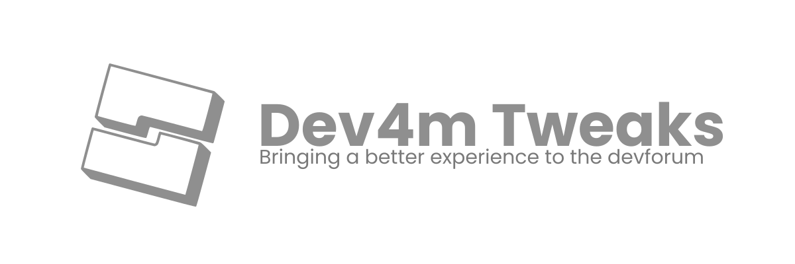

    
     

    Adds Emojis and Flairs to the <a href="https://devforum.roblox.com/"> Dev4m</a>, will have more functionality along the road.

    Check out the releases <a href="https://github.com/zapacni/dev4m-tweaks/releases">here</a>

    Currently supported emojis are found in <a href="https://github.com/zapacni/dev4m-tweaks/blob/master/src/emojis.js">`src/emojis.js`</a>, 
    and flairs <a href="https://github.com/zapacni/dev4m-tweaks/blob/master/src/flairs.js">`src/flairs.js`</a>.

